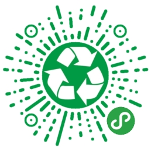
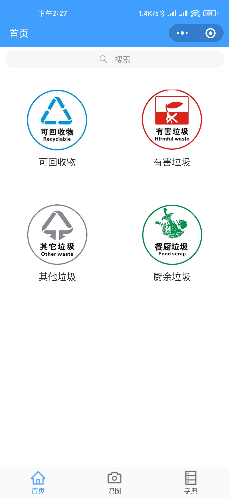
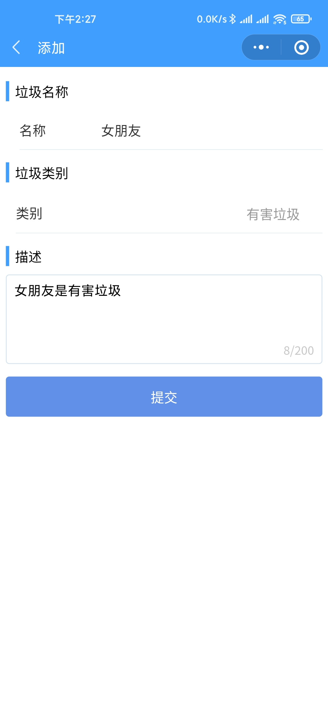
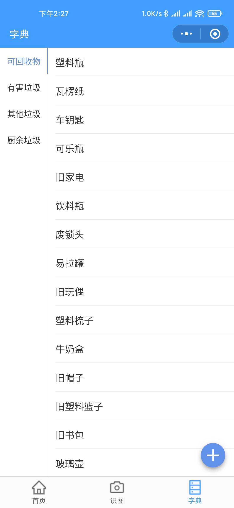
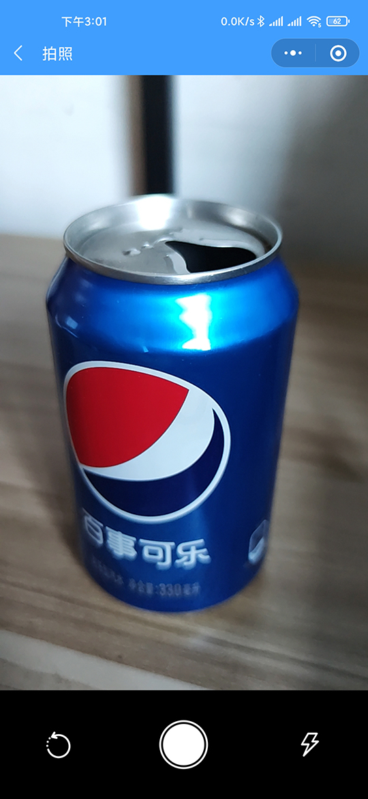
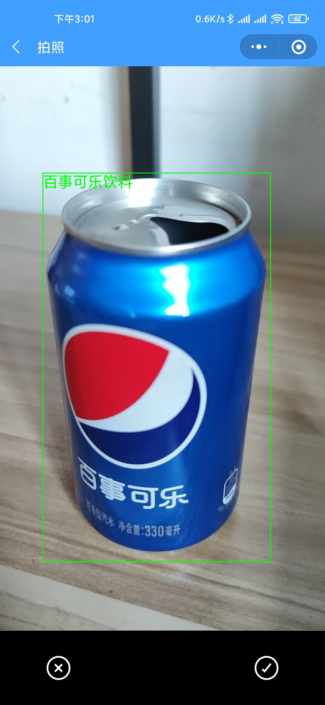
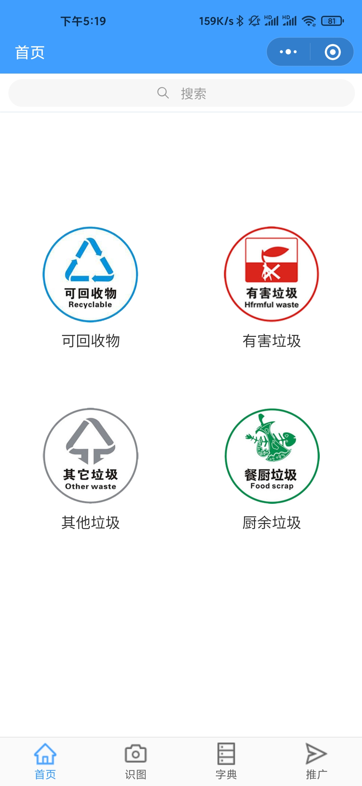

# 垃圾分类助手

辅助生活垃圾进行分类，支持拍照识别、关键词搜索、字典检索等功能。

图像识别功能使用百度AI平台完成，数据库从上海垃圾分类官网爬取。

### 二维码

<div align="center">
  
  
</div>

### 技术栈

* 小程序: Taro, GraphQL, Apollo, TypeScript, React, Canvas
* 后台: AntDesign, TypeScript, React
* 服务端: Nest, Mongoose, GraphQL, Apollo, TypeScript, 百度AI

### 部署

##### weapp

```bash
cd ./weapp

yarn  // 安装依赖

// 修改 config.ts 中的配置

yarn build  // 打包

// 使用微信开发工具打开dist目录
```

##### server

```bash
cd ./server

yarn  // 安装依赖

// 修改 main.ts 中的配置

yarn build  // 打包

cd ./dist && node main.js  // 运行

```

##### admin

```bash
cd ./admin

yarn  // 安装依赖

yarn build  // 打包

cd ./dist

直接打开html文件即可
```

### 截图

<div align="center">
  
  
</div>

<div align="center">
  
  
</div>

<div align="center">
  
  
</div>